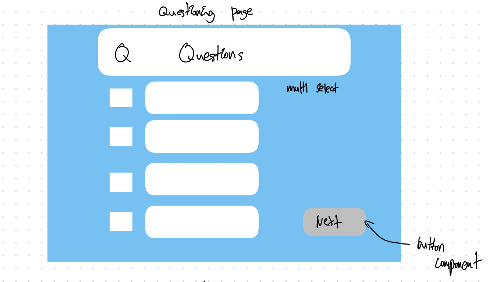

# NewLeafNavi

## Members

- Jusung Park jpa118@sfu.ca
- Jiin Kim jka273@sfu.ca
- Sanghyun Park spa202@sfu.ca
- Kathy Cho hca171@sfu.ca
- Tommy Oh koa18@sfu.ca
## Short Description
NewLeafNavi is a web-based AI application designed to help users find ideal locations to begin a fresh chapter in their lives while traveling. When users initiate the program, it gathers their personal preferences across various categories to create a personalized travel plan. Subsequently, the AI presents a map displaying the top travel destinations based on the collected data.

## Requirements
**note**: This project is required to run the command down below to download all the dependencies.

```bash
// to install all the dependencies
npm install
// to run react project
npm start
```

This web application uses Google map and Chat GPT API. Users need to create .env file to store Google maps API key and Chat GPT API key in the root directory.

## Rough UI Sketch/Design

Starting page


Questioning page


Result page
